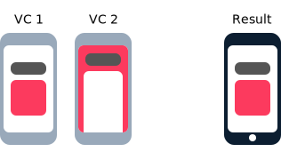
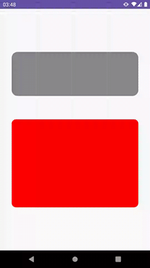

# Animation Interview

This repo aims to solve the problem proposed in the Compose interview.

The problem was to approach a similar screen transition as the [HeroTransitions](https://github.com/HeroTransitions/Hero) that is available on iOS.

The screen transition for this test:

